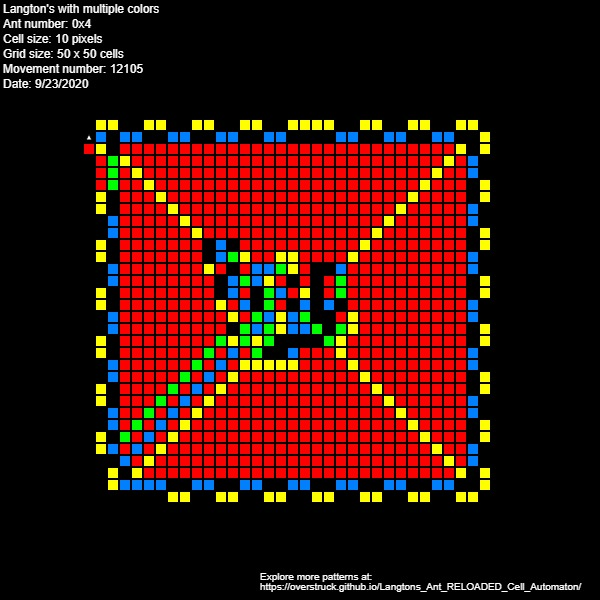
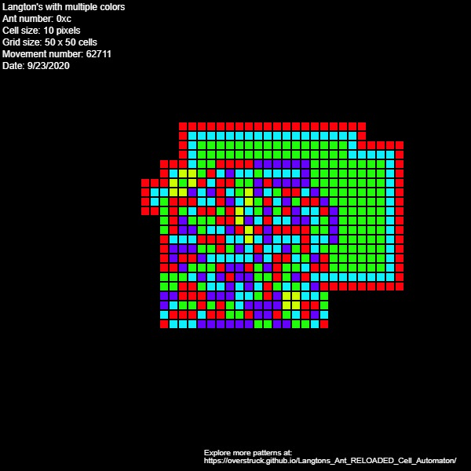

# Langton's Ant RELOADED Cell Automaton
This project implements [Langton's Ant](https://en.wikipedia.org/wiki/Langton%27s_ant) to multiple colors

The program is written in [P5.js](https://p5js.org/) + vanilla Javascript with an HTML web page for display.

Use this program live here: https://overstruck.github.io/Langtons_Ant_RELOADED_Cell_Automaton/

# Description
The Ant will be shown in a 2D grid of black, red, yellow, blue, and green cells; initially all are black.
The Ant crawl on a 2D grid where each cell has a color (initially all are black). As an Ant crawls, it first notices the color of the cell it is on and then changes its direction/heading based on this color, after that, it "increments" the color of the cell under it to the next color in sequence (wrapping around if needed), and finally moves one cell in its new direction (wrapping around on the grid if needed).

Each color is associated with a change of direction: to the Left or to the Right of the Ant's current heading, based on the Ant's number and the index order of that color in the color sequence.
Initially, the grid is all black and the Ant is in the center cell, heading North (toward the top)

For an Ant with number: #0x15 (hex), the binary number is 10101 (21 decimal)
In this case, the Ant turning states (behavior) is LRLRL, where a binary 1 bit means turn Left, and a 0 means turn Right.
Each cell has 5 states, one for each binary digit position in the 5 bits (10101). Each state is represented on the grid by a color (for easy visuals), with the color/state sequence (from low bit to high bit) being Black=0 → Red=1 → Yellow=2 → Blue=3 → Green=4 → Black=0 (wrapped), etc. 
Hence, Ant #0x15 turns Right on Red or Blue, and else Left.

### Example (Ant #0x15) 

Ant Number | Corresponding Turn (behavior) | Color Sequence
------------ | --------------------------- |-------------
1 | LEFT | Black
0 | RIGHT | Red
1 | LEFT | Yellow
0 | RIGHT | Blue
1 | LEFT | Green

This project aims to provide a fun and interactive way to explore the patterns produced by Langton's Ant with multiple colors.

# Examples

Feel free to explore with different cell sizes, grid sizes, themes (different cells colors), etc.
Remember that some patterns only emerge until some time has passed, a lot won't be evident in during the early stages of the Ant simulation

# Contributing
All source code is heavily commented. Feel free to add any features, themes, options you want.

# TODO
* Improve GUI
* Add multiple Ants to the same grid - should make for some interesting patterns

